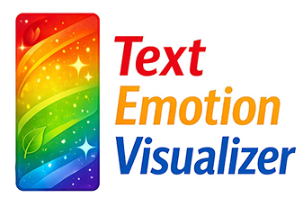

---

<!-- Text Emotion Visualizer -->

# $\color{red}{\textsf{Text}}$ $\color{gold}{\textsf{Emotion}}$ $\color{blue}{\textsf{Visualizer}}$

**Text Emotion Visualizer** - a web application that transforms written text into emotion-driven color visualizations using Natural Language Processing.

Enter any English text, and the app detects its emotional tone using a fine-tuned RoBERTa model, then renders a color gradient based on the detected emotions. Colors are mapped according to Plutchik's Wheel of Emotions.

**Live demo:** [AI-NLP-TextEmotionVisualizer](https://ai-nlp-tev-955791681200.europe-west1.run.app)

---

## How It Works

1. **Text preprocessing** — the input is tokenized using Byte-Pair Encoding (BPE), converted to numeric IDs, padded/truncated to 512 tokens, and paired with an attention mask.
2. **Emotion detection** — the preprocessed input is passed through a DistilRoBERTa transformer model fine-tuned for emotion classification (`j-hartmann/emotion-english-distilroberta-base`). The model outputs probabilities for 7 emotions: anger, disgust, fear, joy, neutral, sadness, surprise.
3. **Color mapping** — each emotion is mapped to a color based on Plutchik's Wheel:

   | Emotion  | Color  | HEX     |
   |----------|--------|---------|
   | anger    | Red    | #FF0000 |
   | disgust  | Brown  | #8B4513 |
   | fear     | Purple | #4B0082 |
   | joy      | Gold   | #FFD700 |
   | neutral  | Grey   | #808080 |
   | sadness  | Blue   | #0000FF |
   | surprise | Orange | #FFA500 |

4. **Gradient rendering** — a vertical gradient image is generated using a sigmoid interpolation between the top-2 emotion colors. The transition point is determined by the probability of the dominant emotion (inspired by [zsxkib/replicate-emotion2colour](https://github.com/zsxkib/replicate-emotion2colour)).

---

## Technologies

- **Python 3.12**
- **Hugging Face Transformers** — tokenization and model inference (DistilRoBERTa)
- **PyTorch** — tensor operations and neural network backend
- **Streamlit** — web application interface
- **Pillow** — image generation
- **Docker** — containerization
- **Google Cloud Run** — cloud deployment

---

## Project Files

| File | Description |
|------|-------------|
| `app.py` | Streamlit web application — UI, gradient rendering, user interaction |
| `analyze_emotions.py` | Core emotion analysis module — loads the model, runs inference, filters results, maps emotions to colors |
| `model_testing.py` | Step-by-step preprocessing and inference script with detailed output (for development and debugging) |
| `model_download.py` | Utility script to download and save the model weights locally |
| `lib_test.py` | Library compatibility and dependency test script |
| `relevant_text.txt` | Sample text file loaded by default in the app |
| `model/` | Locally saved model weights and tokenizer files |
| `requirements.txt` | Python dependencies |
| `Dockerfile` | Docker container configuration |
